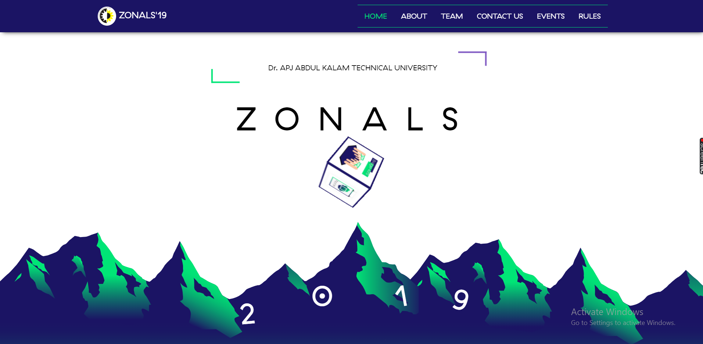
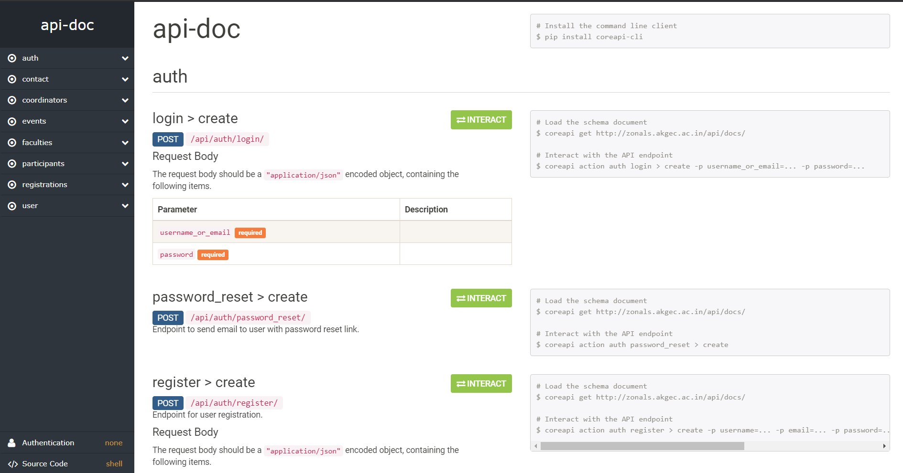
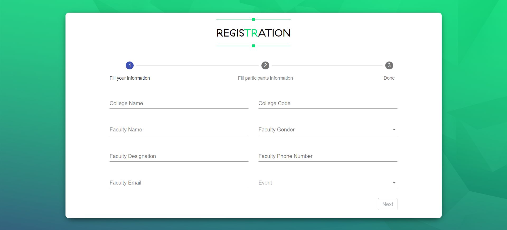

# Aktu official zonal 2019 website



## Software

Frontend – Angular, ThreeJs & Angular Material.
Backend – Django, Django Rest.

## Architecture

The website content is mostly stored as text in a PostgreSQL database. Access to this data is provided via endpoints implemented by a Django backend.

Most of the application logic resides in an Angular 2 single page application run in the browser.

When the site is first visited, the Angular 2 application is downloaded and runs to render the initial page. All the other page content is downloaded in the background so that clicks on internal links can be serviced by the SPA without further recourse to the backend.

Logged in users gain access to additional controls to edit the content of website and manage Registration.

There are also some text manipulation tools, implemented in Javascript which merely process text input in the local browser session.

## Development Environment

Tested on Ubuntu 16.04 with anaconda python installed.

### Requirements

You need the following to run this app:

- Python 3.6 or higher (Python 2.x is not supported by Django 2.x)
- [Pipenv](https://pipenv.readthedocs.io/)
- Node v10.x or higher
- NPM v6.x or higher

### Setup

1. Get source code: git clone https://github.com/deepanshut041/zonal.git
2. Open a terminal at the repo root for setting up backend server
    ```bash
    mkvirtualenv zonal
    pip install -r requirements.txt
    cd backend
    python manage.py runserver
    ```
3. Open new a terminal at the repo root for setting up frontend server.
    ```bash
    cd client
    npm i -g @angular/cli
    npm i
    ng serve
    python manage.py runserver
    ```
Backend server starts at http://localhost:8000 and frontend server start at http://localhost:4200

## API Endpoints



[View Full Api Doc](./docs/api-doc.html)

## Screenshots



More Photos

- [Photo 1](./images/screen-1.png)
- [Photo 2](./images/screen-2.png)
- [Photo 3](./images/screen-3.png)
- [Photo 4](./images/screen-4.png)
- [Photo 5](./images/screen-5.png)
- [Photo 6](./images/screen-6.png)


## Questions?

If you spot an error when trying to run the app, please file a bug in the GitHub issue tracker.

Please do not create issues or email me asking for support for your own projects. I cannot provide support for your custom applications.
